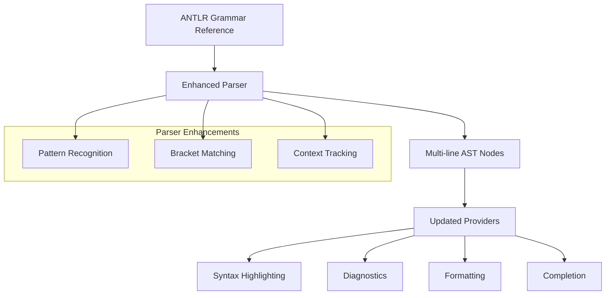

# Design Document

## Overview

This design addresses the improvement of multi-line pattern parsing in the Drools VSCode extension. The current parser implementation needs to be enhanced to properly handle condition patterns where parentheses can span multiple lines, following the official Drools ANTLR grammar specification. The solution involves updating the parser logic, improving syntax highlighting rules, and enhancing the diagnostic and formatting providers to correctly handle multi-line constructs.

## Architecture

The multi-line pattern support will be implemented through enhancements to existing components rather than introducing new architectural elements:



### Key Design Decisions

- **ANTLR Grammar Compliance**: Align parser behavior with the official DRL6Expressions.g grammar
- **Incremental Enhancement**: Modify existing components rather than rewriting the parser
- **Context-Aware Parsing**: Track parentheses depth and context across line boundaries
- **Backward Compatibility**: Ensure existing single-line patterns continue to work correctly

## Components and Interfaces

### 1. Enhanced Drools Parser (`src/server/parser/droolsParser.ts`)

**New Responsibilities:**
- Track parentheses depth across multiple lines
- Maintain parsing context for multi-line patterns
- Handle nested condition patterns correctly

**Enhanced Interfaces:**
```typescript
interface ParsingContext {
    parenthesesDepth: number;
    currentPattern: PatternType;
    lineStart: number;
    columnStart: number;
    inMultiLinePattern: boolean;
}

interface MultiLinePattern {
    type: 'exists' | 'not' | 'eval' | 'forall' | 'collect' | 'accumulate';
    startPosition: Position;
    endPosition: Position;
    content: string;
    nestedLevel: number;
}

interface EnhancedConditionNode extends ConditionNode {
    isMultiLine: boolean;
    spanLines: number[];
    parenthesesRanges: Range[];
}
```

### 2. Updated Syntax Highlighting (`syntaxes/drools.tmLanguage.json`)

**Enhanced Rules:**
- Multi-line pattern matching for condition keywords
- Bracket matching across line boundaries
- Nested pattern highlighting

**New Grammar Patterns:**
```json
{
    "name": "meta.condition.multiline.drools",
    "begin": "\\b(exists|not|eval|forall|collect|accumulate)\\s*\\(",
    "end": "\\)",
    "beginCaptures": {
        "1": {"name": "keyword.control.drools"}
    },
    "patterns": [
        {"include": "#multiline-content"},
        {"include": "#nested-patterns"}
    ]
}
```

### 3. Enhanced Diagnostic Provider (`src/server/providers/diagnosticProvider.ts`)

**New Validation Logic:**
```typescript
interface MultiLineValidation {
    validateParenthesesMatching(ast: DroolsAST): Diagnostic[];
    validateMultiLinePatterns(patterns: MultiLinePattern[]): Diagnostic[];
    checkNestedPatternSyntax(pattern: MultiLinePattern): Diagnostic[];
}
```

### 4. Improved Formatting Provider (`src/server/providers/formattingProvider.ts`)

**Enhanced Formatting Rules:**
```typescript
interface MultiLineFormatting {
    formatMultiLinePattern(pattern: MultiLinePattern): TextEdit[];
    alignClosingParentheses(pattern: MultiLinePattern): TextEdit[];
    indentNestedLevels(pattern: MultiLinePattern): TextEdit[];
}
```

### 5. Updated Completion Provider (`src/server/providers/completionProvider.ts`)

**Context-Aware Completion:**
```typescript
interface MultiLineCompletionContext extends CompletionContext {
    multiLinePattern?: MultiLinePattern;
    parenthesesDepth: number;
    nestedLevel: number;
}
```

## Data Models

### 1. Multi-Line Pattern Representation

```typescript
interface MultiLinePatternNode {
    type: PatternType;
    keyword: string; // 'exists', 'not', 'eval', etc.
    startLine: number;
    endLine: number;
    startColumn: number;
    endColumn: number;
    content: string;
    nestedPatterns: MultiLinePatternNode[];
    parenthesesRanges: Range[];
    isComplete: boolean;
}

enum PatternType {
    EXISTS = 'exists',
    NOT = 'not',
    EVAL = 'eval',
    FORALL = 'forall',
    COLLECT = 'collect',
    ACCUMULATE = 'accumulate',
    NESTED_CONDITION = 'nested'
}
```

### 2. Enhanced AST Nodes

```typescript
interface EnhancedRuleNode extends RuleNode {
    multiLinePatterns: MultiLinePatternNode[];
    hasMultiLineConditions: boolean;
}

interface ParenthesesTracker {
    openPositions: Position[];
    closePositions: Position[];
    matchedPairs: Array<{open: Position, close: Position}>;
    unmatchedOpen: Position[];
    unmatchedClose: Position[];
}
```

## Error Handling

### 1. Multi-Line Pattern Errors

**Unmatched Parentheses:**
- Track opening and closing parentheses across lines
- Report specific line and column for unmatched brackets
- Provide suggestions for fixing bracket mismatches

**Incomplete Patterns:**
- Detect when multi-line patterns are not properly closed
- Handle EOF within multi-line patterns gracefully
- Provide context-aware error messages

### 2. Parsing Recovery Strategies

**Incremental Parsing:**
- Parse multi-line patterns as complete units
- Maintain parsing state across line boundaries
- Resume parsing after encountering errors

**Error Tolerance:**
- Continue parsing when encountering malformed multi-line patterns
- Provide partial AST for incomplete patterns
- Enable syntax highlighting even with parsing errors

## Testing Strategy

### 1. Multi-Line Pattern Test Cases

**Valid Patterns:**
```drools
rule "Multi-line exists"
when
    exists(
        Person(age > 18,
               name != null)
    )
then
    // action
end

rule "Nested multi-line"
when
    exists(
        Person(age > 18) and
        not(
            Account(
                owner == $person,
                balance < 0
            )
        )
    )
then
    // action
end
```

**Invalid Patterns:**
```drools
rule "Unmatched parentheses"
when
    exists(
        Person(age > 18
    // missing closing parenthesis
then
    // action
end
```

### 2. Test Categories

**Parser Tests:**
- Multi-line pattern recognition
- Nested pattern parsing
- Parentheses matching across lines
- Error recovery for incomplete patterns

**Syntax Highlighting Tests:**
- Multi-line keyword highlighting
- Bracket matching visualization
- Nested pattern coloring

**Diagnostic Tests:**
- Unmatched parentheses detection
- Invalid multi-line pattern identification
- Context-aware error messages

**Formatting Tests:**
- Multi-line pattern indentation
- Closing parentheses alignment
- Nested level formatting

**Completion Tests:**
- Context-aware completions within multi-line patterns
- Keyword suggestions in nested contexts
- Operator completions across lines

## Performance Considerations

### 1. Parsing Optimization

**Incremental Multi-Line Parsing:**
- Parse only modified multi-line patterns
- Cache multi-line pattern boundaries
- Optimize parentheses matching algorithms

**Memory Management:**
- Limit depth of nested pattern tracking
- Clean up parsing context after completion
- Efficient storage of multi-line pattern metadata

### 2. Real-Time Performance

**Syntax Highlighting:**
- Optimize multi-line pattern matching regex
- Use efficient bracket matching algorithms
- Minimize re-parsing on incremental changes

**Diagnostic Performance:**
- Batch multi-line pattern validation
- Cache validation results for unchanged patterns
- Prioritize visible multi-line patterns

## Implementation Phases

### Phase 1: Parser Enhancement
- Update parser to track parentheses across lines
- Implement multi-line pattern recognition
- Add context tracking for nested patterns

### Phase 2: Syntax Highlighting
- Update TextMate grammar for multi-line patterns
- Add bracket matching across line boundaries
- Implement nested pattern highlighting

### Phase 3: Provider Updates
- Enhance diagnostic provider for multi-line validation
- Update formatting provider for multi-line patterns
- Improve completion provider context awareness

### Phase 4: Testing and Optimization
- Comprehensive test suite for multi-line patterns
- Performance optimization for large files
- Edge case handling and error recovery

## Security Considerations

### 1. Input Validation
- Validate multi-line pattern depth limits
- Prevent excessive nesting that could cause performance issues
- Sanitize multi-line pattern content before processing

### 2. Resource Management
- Limit memory usage for complex multi-line patterns
- Prevent infinite loops in parentheses matching
- Timeout protection for complex pattern parsing

## Compatibility

### 1. Backward Compatibility
- Ensure existing single-line patterns continue to work
- Maintain compatibility with current Drools syntax
- Preserve existing extension behavior for simple cases

### 2. Forward Compatibility
- Design extensible pattern recognition system
- Support future Drools grammar enhancements
- Maintain alignment with ANTLR grammar updates