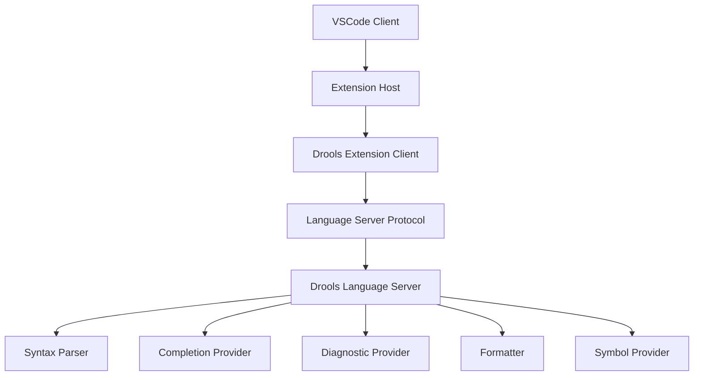

# Design Document

## Overview

The Drools VSCode Extension is a comprehensive language support extension that provides syntax highlighting, IntelliSense, error detection, formatting, and productivity features for Drools Rule Language (.drl) files. The extension follows VSCode's Language Server Protocol (LSP) architecture to deliver robust language support while maintaining good performance and extensibility.

## Architecture

The extension uses a two-part architecture:

1. **Client Extension**: VSCode extension that handles UI interactions, file associations, and communicates with the language server
2. **Language Server**: Standalone process that provides language intelligence features like syntax analysis, completion, and validation



### Key Architectural Decisions

- **Language Server Protocol**: Enables language features to work across different editors and provides better performance through process separation
- **TextMate Grammar**: Used for syntax highlighting with custom Drools grammar rules
- **Tree-sitter Parser**: Provides robust syntax parsing for error detection and code intelligence
- **Modular Design**: Each language feature is implemented as a separate provider for maintainability

## Components and Interfaces

### 1. Extension Client (`src/extension.ts`)

**Responsibilities:**
- Extension activation and deactivation
- Language server lifecycle management
- File association registration
- Command registration

**Key Interfaces:**
```typescript
interface DroolsExtension {
    activate(context: ExtensionContext): void;
    deactivate(): void;
    startLanguageServer(): void;
    registerCommands(): void;
}
```

### 2. Language Server (`src/server/`)

#### 2.1 Main Server (`server.ts`)
**Responsibilities:**
- LSP connection management
- Request routing to appropriate providers
- Document synchronization

#### 2.2 Syntax Parser (`parser/droolsParser.ts`)
**Responsibilities:**
- Parse .drl files into Abstract Syntax Tree (AST)
- Identify language constructs (rules, functions, imports)
- Provide syntax error detection

**Key Interfaces:**
```typescript
interface DroolsParser {
    parse(text: string): DroolsAST;
    validateSyntax(ast: DroolsAST): Diagnostic[];
}

interface DroolsAST {
    packageDeclaration?: PackageNode;
    imports: ImportNode[];
    rules: RuleNode[];
    functions: FunctionNode[];
    globals: GlobalNode[];
}
```

#### 2.3 Completion Provider (`providers/completionProvider.ts`)
**Responsibilities:**
- Keyword completion
- Fact type suggestions
- Function parameter hints
- Import suggestions

#### 2.4 Diagnostic Provider (`providers/diagnosticProvider.ts`)
**Responsibilities:**
- Syntax error detection
- Semantic validation
- Warning generation for best practices

#### 2.5 Formatting Provider (`providers/formattingProvider.ts`)
**Responsibilities:**
- Document formatting
- Range formatting
- Format-on-save support

#### 2.6 Symbol Provider (`providers/symbolProvider.ts`)
**Responsibilities:**
- Document outline
- Go-to-definition
- Find references

### 3. Grammar and Syntax (`syntaxes/`)

#### 3.1 TextMate Grammar (`drools.tmLanguage.json`)
**Responsibilities:**
- Syntax highlighting rules
- Token classification
- Scope definitions

#### 3.2 Language Configuration (`language-configuration.json`)
**Responsibilities:**
- Bracket matching pairs
- Comment definitions
- Auto-closing pairs
- Indentation rules

### 4. Snippets (`snippets/`)

**Responsibilities:**
- Pre-defined code templates
- Tab stop definitions
- Variable placeholders

## Data Models

### 1. Drools Language Elements

```typescript
interface RuleNode {
    name: string;
    salience?: number;
    when: ConditionNode[];
    then: ActionNode[];
    attributes: RuleAttribute[];
    location: Range;
}

interface ConditionNode {
    type: 'pattern' | 'eval' | 'exists' | 'not';
    content: string;
    constraints: ConstraintNode[];
    location: Range;
}

interface ActionNode {
    type: 'insert' | 'update' | 'delete' | 'modify';
    content: string;
    location: Range;
}

interface FunctionNode {
    name: string;
    returnType: string;
    parameters: ParameterNode[];
    body: string;
    location: Range;
}
```

### 2. Language Server Types

```typescript
interface DroolsDocument {
    uri: string;
    version: number;
    content: string;
    ast: DroolsAST;
    diagnostics: Diagnostic[];
}

interface CompletionContext {
    position: Position;
    triggerCharacter?: string;
    currentToken: string;
    scope: 'global' | 'rule' | 'when' | 'then' | 'function';
}
```

## Error Handling

### 1. Syntax Errors
- **Parser Errors**: Malformed rule syntax, missing keywords, unmatched brackets
- **Semantic Errors**: Undefined variables, type mismatches, invalid function calls
- **Warning Conditions**: Unused variables, deprecated syntax, style violations

### 2. Language Server Errors
- **Connection Failures**: Graceful degradation when language server is unavailable
- **Parse Failures**: Partial parsing with error recovery
- **Performance Issues**: Timeout handling for large files

### 3. Error Recovery Strategies
- **Incremental Parsing**: Only re-parse changed sections
- **Error Tolerance**: Continue parsing after encountering errors
- **Fallback Modes**: Basic syntax highlighting when full parsing fails

## Testing Strategy

### 1. Unit Tests
- **Parser Tests**: Verify AST generation for various Drools constructs
- **Provider Tests**: Test completion, diagnostic, and formatting providers
- **Grammar Tests**: Validate syntax highlighting rules

### 2. Integration Tests
- **Language Server Tests**: End-to-end LSP communication
- **Extension Tests**: VSCode extension activation and feature integration
- **Performance Tests**: Large file handling and response times

### 3. Test Data
- **Sample .drl Files**: Comprehensive collection of valid and invalid Drools files
- **Edge Cases**: Complex nested rules, unusual syntax patterns
- **Real-world Examples**: Actual business rule files from various domains

### 4. Testing Framework
- **Jest**: Unit testing framework
- **VSCode Test Runner**: Extension integration tests
- **Mock LSP Client**: Language server testing

## Performance Considerations

### 1. Parsing Optimization
- **Incremental Parsing**: Only re-parse modified sections
- **Lazy Loading**: Parse on-demand for large files
- **Caching**: Cache AST and diagnostic results

### 2. Memory Management
- **Document Cleanup**: Remove unused document data
- **AST Pruning**: Limit AST depth for very large files
- **Garbage Collection**: Proper cleanup of language server resources

### 3. Responsiveness
- **Async Operations**: Non-blocking parsing and analysis
- **Debouncing**: Limit frequency of expensive operations
- **Progressive Enhancement**: Basic features first, advanced features as available

## Security Considerations

### 1. Input Validation
- **File Size Limits**: Prevent processing of extremely large files
- **Content Sanitization**: Validate .drl file content before parsing
- **Path Validation**: Ensure file paths are within workspace boundaries

### 2. Process Isolation
- **Language Server Sandboxing**: Run language server in separate process
- **Resource Limits**: Prevent excessive CPU/memory usage
- **Error Boundaries**: Isolate failures to prevent extension crashes

## Deployment and Distribution

### 1. Extension Packaging
- **VSIX Package**: Standard VSCode extension format
- **Marketplace Publishing**: Automated publishing pipeline
- **Version Management**: Semantic versioning with changelog

### 2. Language Server Distribution
- **Embedded Server**: Include language server in extension package
- **Platform Binaries**: Pre-compiled binaries for different platforms
- **Fallback Mode**: Basic features without language server

### 3. Configuration Management
- **User Settings**: Configurable extension behavior
- **Workspace Settings**: Project-specific configurations
- **Default Values**: Sensible defaults for all settings