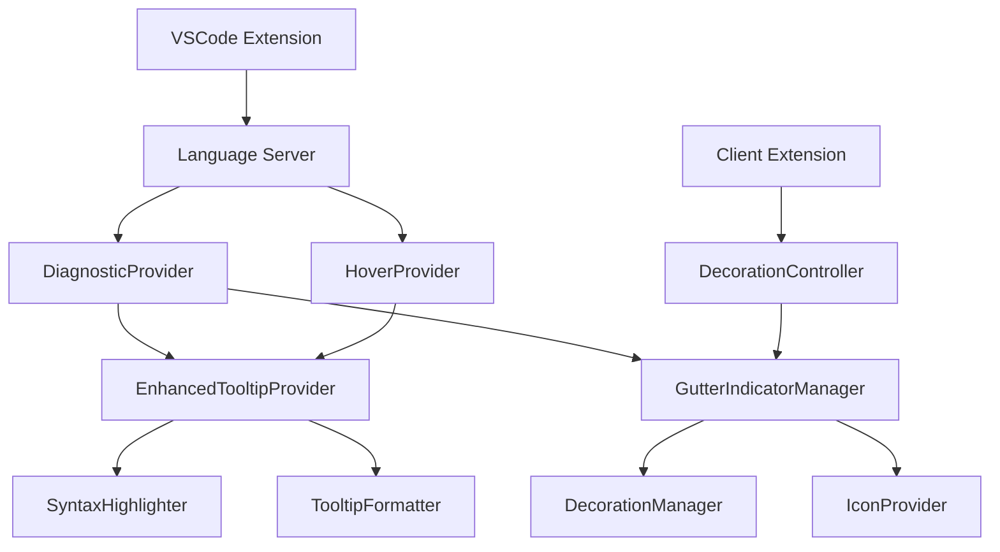

# Design Document

## Overview

This design implements enhanced tooltips with rich syntax highlighting and visual gutter indicators for the Drools VSCode extension. The solution extends the existing diagnostic system to provide richer visual feedback through enhanced hover providers and decoration APIs.

## Architecture

### Component Overview



### Data Flow

1. **Diagnostic Generation**: Enhanced diagnostic provider creates diagnostics with rich metadata
2. **Tooltip Enhancement**: Hover provider intercepts hover requests and generates enhanced tooltips
3. **Gutter Decoration**: Client-side decoration manager creates gutter indicators based on diagnostics
4. **User Interaction**: Click/hover events on gutter icons trigger tooltip display

## Components and Interfaces

### 1. Enhanced Diagnostic Provider

**Location**: `src/server/providers/enhancedDiagnosticProvider.ts`

```typescript
interface EnhancedDiagnostic extends Diagnostic {
    metadata: {
        codeContext?: string;
        errorToken?: string;
        suggestion?: string;
        beforeAfter?: {
            before: string;
            after: string;
        };
        language: 'java' | 'drools' | 'generic';
        severity: 'error' | 'warning' | 'info';
    };
}

class EnhancedDiagnosticProvider extends DroolsDiagnosticProvider {
    public provideDiagnostics(document: TextDocument, ast: DroolsAST, parseErrors: ParseError[]): EnhancedDiagnostic[];
}
```

### 2. Enhanced Tooltip Provider

**Location**: `src/server/providers/enhancedTooltipProvider.ts`

```typescript
interface TooltipContent {
    title: string;
    codeContext?: string;
    suggestion?: string;
    comparison?: {
        before: string;
        after: string;
    };
    tip?: string;
    language: 'java' | 'drools' | 'generic';
}

class EnhancedTooltipProvider {
    public generateTooltip(diagnostic: EnhancedDiagnostic): MarkdownString;
    public formatCodeContext(context: string, errorToken: string, language: string): string;
    public formatSuggestion(incorrect: string, correct: string, context: string): string;
    public formatComparison(before: string, after: string, language: string): string;
}
```

### 3. Gutter Indicator Manager

**Location**: `src/client/gutterIndicatorManager.ts`

```typescript
interface GutterIndicator {
    line: number;
    severity: 'error' | 'warning' | 'info';
    message: string;
    tooltip: MarkdownString;
}

class GutterIndicatorManager {
    private decorationTypes: Map<string, vscode.TextEditorDecorationType>;
    private indicators: Map<string, GutterIndicator[]>;
    
    public updateIndicators(uri: string, diagnostics: EnhancedDiagnostic[]): void;
    public createDecorations(editor: vscode.TextEditor): void;
    public handleGutterClick(line: number): void;
}
```

### 4. Syntax Highlighter (Enhanced)

**Location**: `src/server/utils/enhancedSyntaxHighlighter.ts`

```typescript
interface HighlightTheme {
    keyword: string;
    type: string;
    variable: string;
    string: string;
    number: string;
    operator: string;
    error: string;
    comment: string;
}

class EnhancedSyntaxHighlighter extends DiagnosticSyntaxHighlighter {
    public static applyTheme(content: string, theme: HighlightTheme): string;
    public static generateTooltipMarkdown(content: TooltipContent): MarkdownString;
    public static createInteractiveTooltip(diagnostic: EnhancedDiagnostic): MarkdownString;
}
```

## Data Models

### Enhanced Diagnostic Metadata

```typescript
interface DiagnosticMetadata {
    // Code context (1-2 lines around error)
    codeContext: {
        lines: string[];
        errorLine: number;
        startLine: number;
        endLine: number;
    };
    
    // Error token information
    errorToken: {
        text: string;
        startChar: number;
        endChar: number;
    };
    
    // Suggestion information
    suggestion?: {
        type: 'replacement' | 'addition' | 'removal';
        incorrect: string;
        correct: string;
        explanation: string;
    };
    
    // Language context
    language: 'java' | 'drools' | 'generic';
    
    // Severity for gutter icons
    gutterSeverity: 'error' | 'warning' | 'info';
}
```

### Tooltip Template

```typescript
interface TooltipTemplate {
    header: {
        icon: string;
        title: string;
        position: string;
    };
    
    body: {
        description: string;
        codeBlock?: {
            language: string;
            content: string;
            highlightedLines?: number[];
        };
    };
    
    footer?: {
        suggestion?: string;
        comparison?: {
            before: string;
            after: string;
        };
        tip?: string;
    };
}
```

## Error Handling

### Tooltip Generation Errors

1. **Fallback Content**: If syntax highlighting fails, display plain text tooltip
2. **Performance Limits**: Limit tooltip content size to prevent performance issues
3. **Theme Compatibility**: Graceful degradation if theme colors are unavailable

### Gutter Decoration Errors

1. **Icon Loading**: Fallback to text indicators if icons fail to load
2. **Decoration Conflicts**: Handle conflicts with other extensions' decorations
3. **Memory Management**: Clean up decorations when documents are closed

## Testing Strategy

### Unit Tests

1. **Syntax Highlighter Tests**
   - Test Java keyword highlighting
   - Test Drools syntax highlighting
   - Test error token highlighting
   - Test theme adaptation

2. **Tooltip Provider Tests**
   - Test tooltip generation for different error types
   - Test Markdown formatting
   - Test code context extraction

3. **Gutter Manager Tests**
   - Test decoration creation
   - Test icon selection based on severity
   - Test click handling

### Integration Tests

1. **End-to-End Tooltip Tests**
   - Test hover over errors shows enhanced tooltips
   - Test tooltip content matches diagnostic information
   - Test performance with large files

2. **Gutter Indicator Tests**
   - Test gutter icons appear for diagnostics
   - Test clicking gutter icons shows tooltips
   - Test multiple errors on same line

### Visual Tests

1. **Theme Compatibility**
   - Test with dark themes
   - Test with light themes
   - Test with high contrast themes

2. **Tooltip Appearance**
   - Test tooltip positioning
   - Test tooltip sizing
   - Test syntax highlighting colors

## Implementation Plan

### Phase 1: Enhanced Tooltip Provider
- Extend existing hover provider to generate rich tooltips
- Implement enhanced syntax highlighter with theme support
- Add tooltip templates and formatting

### Phase 2: Gutter Indicators
- Create client-side decoration manager
- Implement gutter icon system
- Add click handling for gutter interactions

### Phase 3: Integration and Polish
- Integrate enhanced tooltips with gutter indicators
- Add performance optimizations
- Implement theme adaptation

### Phase 4: Testing and Refinement
- Comprehensive testing across different scenarios
- Performance testing with large files
- User experience refinements

## Performance Considerations

### Tooltip Generation
- Cache formatted tooltips to avoid regeneration
- Limit tooltip content size (max 500 lines)
- Debounce hover events to prevent excessive generation

### Gutter Decorations
- Use efficient decoration APIs
- Batch decoration updates
- Clean up decorations when not needed

### Memory Management
- Dispose of unused decorations
- Clear tooltip caches periodically
- Monitor memory usage in large files

## Accessibility

### Screen Reader Support
- Provide alt text for gutter icons
- Ensure tooltip content is readable by screen readers
- Support keyboard navigation to gutter indicators

### High Contrast Support
- Adapt colors for high contrast themes
- Ensure sufficient color contrast ratios
- Provide text alternatives for color-coded information

## VSCode Integration

### Native Styling
- Use VSCode's native tooltip styling
- Respect user's color theme preferences
- Follow VSCode's design guidelines

### Extension Compatibility
- Avoid conflicts with other diagnostic providers
- Respect user's extension settings
- Provide configuration options for customization