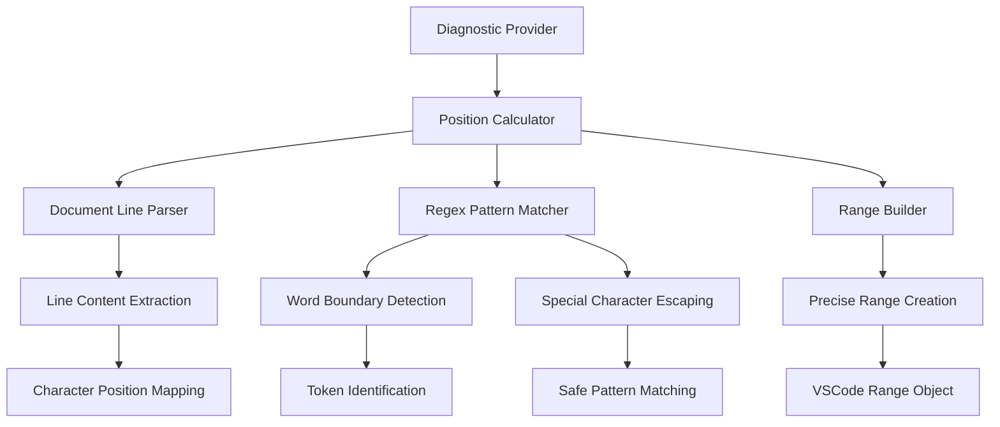
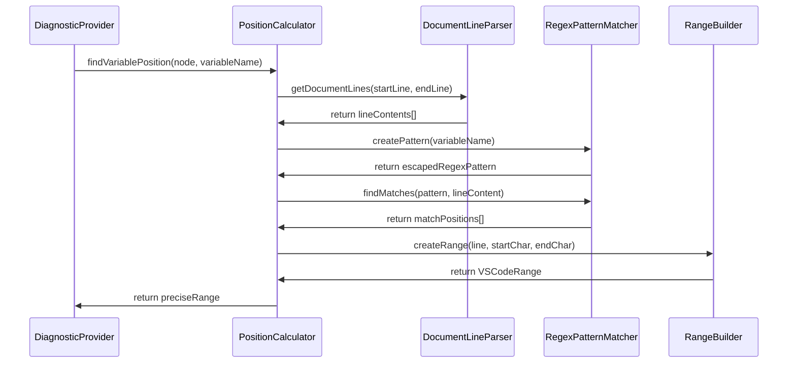

# Design Document

## Overview

The precise underline positioning system enhances the Drools VSCode extension's diagnostic capabilities by providing pixel-perfect error highlighting. This system ensures that error underlines highlight only the problematic text without including any surrounding whitespace, improving the developer experience and making error identification more intuitive.

## Architecture

### High-Level Architecture



### Component Interaction Flow



## Components and Interfaces

### 1. Position Calculator Interface

```typescript
interface IPositionCalculator {
    findVariablePositionInThenClause(thenClause: ThenNode, variableName: string): Range | null;
    findVariableDeclarationPosition(whenClause: WhenNode, variableName: string): Range | null;
    findJavaErrorPosition(line: string, errorToken: string, lineNumber: number): Range | null;
}
```

### 2. Document Line Parser

```typescript
interface IDocumentLineParser {
    getDocumentLines(): string[];
    getLineContent(lineNumber: number): string;
    isWithinRuleBoundary(lineNumber: number, ruleNode: RuleNode): boolean;
}
```

### 3. Regex Pattern Matcher

```typescript
interface IRegexPatternMatcher {
    createWordBoundaryPattern(token: string): RegExp;
    escapeSpecialCharacters(input: string): string;
    findAllMatches(pattern: RegExp, content: string): MatchResult[];
}

interface MatchResult {
    index: number;
    length: number;
    matchedText: string;
}
```

### 4. Range Builder

```typescript
interface IRangeBuilder {
    createRange(line: number, startChar: number, endChar: number): Range;
    validateRange(range: Range): boolean;
    adjustForWhitespace(range: Range, lineContent: string): Range;
}
```

## Data Models

### Position Data Model

```typescript
interface PrecisePosition {
    line: number;
    character: number;
    token: string;
    context: PositionContext;
}

interface PositionContext {
    ruleType: 'LHS' | 'RHS';
    errorType: 'missing-dollar' | 'undefined-variable' | 'java-error' | 'typo';
    indentationLevel: number;
    surroundingText: string;
}
```

### Range Validation Model

```typescript
interface RangeValidation {
    hasLeadingWhitespace: boolean;
    hasTrailingWhitespace: boolean;
    isWordBoundary: boolean;
    isWithinToken: boolean;
    confidence: number; // 0-1 scale
}
```

## Error Handling

### Position Calculation Errors

1. **Token Not Found**
   - Fallback to approximate positioning using AST ranges
   - Log warning for debugging purposes
   - Return null to indicate positioning failure

2. **Multiple Matches**
   - Use context clues (AST node ranges) to select correct match
   - Prefer first occurrence within expected range
   - Log ambiguous match scenarios

3. **Regex Compilation Errors**
   - Escape special characters in variable names
   - Use literal string matching as fallback
   - Handle edge cases with complex variable names

4. **Document Line Access Errors**
   - Validate line numbers before access
   - Handle documents with fewer lines than expected
   - Graceful degradation to AST-based positioning

### Error Recovery Strategies

```typescript
class PositionErrorHandler {
    handleTokenNotFound(token: string, context: PositionContext): Range | null {
        // Try approximate positioning
        // Log for debugging
        // Return fallback range or null
    }
    
    handleMultipleMatches(matches: MatchResult[], context: PositionContext): MatchResult {
        // Use AST context to disambiguate
        // Apply heuristics for best match
        // Return most likely correct match
    }
    
    handleRegexError(pattern: string, error: Error): RegExp | null {
        // Escape problematic characters
        // Create simpler pattern
        // Return safe fallback pattern
    }
}
```

## Testing Strategy

### Unit Testing Approach

1. **Position Calculator Tests**
   - Test each positioning method independently
   - Verify word boundary detection
   - Test special character handling
   - Validate range accuracy

2. **Pattern Matching Tests**
   - Test regex pattern creation
   - Verify escape character handling
   - Test word boundary scenarios
   - Validate multiple match handling

3. **Integration Tests**
   - Test complete positioning pipeline
   - Verify with real Drools code samples
   - Test edge cases and error conditions
   - Performance testing with large files

### Test Data Sets

```typescript
const testCases = [
    {
        name: "Missing Dollar Prefix",
        code: "    condition : Condition()",
        expectedUnderline: "condition",
        errorType: "missing-dollar-prefix"
    },
    {
        name: "Undefined Variable",
        code: "        System.out.println($undefinedVar);",
        expectedUnderline: "$undefinedVar",
        errorType: "undefined-variable"
    },
    {
        name: "Java Capitalization",
        code: "    system.out.println(\"test\");",
        expectedUnderline: "system",
        errorType: "java-capitalization"
    },
    {
        name: "Deep Indentation",
        code: "            $item : Item(price > 50)",
        expectedUnderline: "$item",
        errorType: "variable-declaration"
    }
];
```

### Precision Validation Tests

```typescript
interface PrecisionTest {
    validateNoLeadingWhitespace(range: Range, lineContent: string): boolean;
    validateNoTrailingWhitespace(range: Range, lineContent: string): boolean;
    validateWordBoundaries(range: Range, lineContent: string): boolean;
    validateVisualAlignment(range: Range, expectedToken: string): boolean;
}
```

## Implementation Details

### Core Algorithm

1. **Document Line Access**
   - Use `this.documentLines` array for direct line access
   - Avoid string splitting for better performance
   - Cache line content when processing multiple errors

2. **Pattern Matching Strategy**
   - Use `\b` word boundaries for precise token matching
   - Escape special regex characters in variable names
   - Handle `$` prefix as part of variable name

3. **Range Calculation**
   - Calculate character positions relative to line start
   - Account for multi-line constructs
   - Validate ranges before returning

4. **Context Awareness**
   - Use AST node ranges to limit search scope
   - Distinguish between LHS and RHS contexts
   - Handle rule boundary detection

### Performance Considerations

1. **Efficient Line Access**
   - Pre-split document into lines once
   - Cache frequently accessed lines
   - Limit search scope using AST ranges

2. **Regex Optimization**
   - Compile patterns once and reuse
   - Use specific patterns for different error types
   - Avoid backtracking in complex patterns

3. **Memory Management**
   - Avoid creating unnecessary string copies
   - Reuse Range objects where possible
   - Clean up temporary data structures

### Integration Points

1. **Diagnostic Provider Integration**
   - Replace existing positioning logic
   - Maintain backward compatibility
   - Preserve error message content

2. **AST Integration**
   - Use AST ranges as search boundaries
   - Leverage node type information
   - Maintain consistency with parser output

3. **VSCode API Integration**
   - Return standard VSCode Range objects
   - Ensure compatibility with editor highlighting
   - Support multi-cursor scenarios